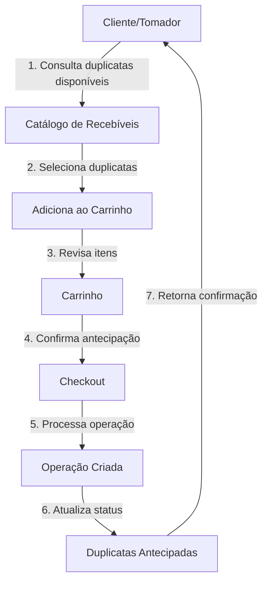

# 🏦 Size - API de Antecipação de Recebíveis

API desenvolvida em .NET 8 para gerenciamento de antecipação de recebíveis, permitindo que empresas antecipem o recebimento de duplicatas através de um fluxo completo de carrinho de compras e checkout.

## 📋 Índice

- [O que é Antecipação de Recebíveis?](#o-que-é-antecipação-de-recebíveis)
- [Arquitetura do Projeto](#arquitetura-do-projeto)
- [Fluxo da API](#fluxo-da-api)
- [Tecnologias Utilizadas](#tecnologias-utilizadas)
- [Pré-requisitos](#pré-requisitos)
- [Configuração do Ambiente](#configuração-do-ambiente)
- [Como Executar](#como-executar)
- [Endpoints da API](#endpoints-da-api)
- [Scripts de Banco de Dados](#scripts-de-banco-de-dados)

> 🚀 **Quer começar rápido?** Veja o [Guia de Início Rápido (5 minutos)](QUICKSTART.md)  
---

## 💰 O que é Antecipação de Recebíveis?

A **Antecipação de Recebíveis** é uma operação financeira que permite que empresas recebam antecipadamente valores referentes a duplicatas (títulos de crédito) que só venceriam no futuro. 

### Como funciona:

1. **Empresa possui recebíveis**: Uma empresa vendeu produtos/serviços e possui duplicatas a receber no futuro
2. **Necessidade de capital**: A empresa precisa de capital de giro imediato
3. **Antecipação**: A empresa solicita a antecipação desses recebíveis através de uma instituição financeira
4. **Desconto aplicado**: É aplicado um desconto (taxa) sobre o valor total das duplicatas
5. **Recebimento imediato**: A empresa recebe o valor líquido (valor original - desconto) de forma antecipada

### Exemplo Prático:

```
Duplicata Original:
- Valor: R$ 10.000,00
- Vencimento: 30 dias
- Taxa de antecipação: 3%

Valor Líquido Recebido:
- Desconto: R$ 300,00 (3% de R$ 10.000)
- Valor a receber: R$ 9.700,00 (imediatamente)
```

---

## 🏗️ Arquitetura do Projeto

O projeto segue os princípios de **Domain-Driven Design (DDD)** e **Clean Architecture**, organizado em camadas:

```
size-tecnico-sustentacao/
│
├── src/
│   ├── size-antecipacao/                          # 🚀 API Principal
│   │   ├── Controllers/                           # Endpoints REST
│   │   ├── Configurations/                        # Configurações e DI
│   │   └── Program.cs                             # Entry point
│   │
│   ├── size.Core/                                 # 🧩 Núcleo Compartilhado
│   │   ├── Communication/                         # Notificações e respostas
│   │   ├── Data/                                  # Contexto base
│   │   ├── DomainObjects/                         # Entidades base
│   │   └── DTOs/                                  # Data Transfer Objects
│   │
│   ├── size.FichaCadastral.*/                    # 📋 Domínio: Ficha Cadastral
│   │   ├── Application/                           # Serviços de aplicação
│   │   ├── Business/                              # Regras de negócio (Tomadores)
│   │   ├── Data/                                  # Acesso a dados
│   │   └── Configurations/                        # Injeção de dependências
│   │
│   ├── size.CatalogoRecebiveis.*/                # 💵 Domínio: Catálogo de Recebíveis
│   │   ├── Application/                           # Serviços de aplicação
│   │   ├── Business/                              # Regras de negócio (Duplicatas)
│   │   ├── Data/                                  # Acesso a dados
│   │   └── Configurations/                        # Injeção de dependências
│   │
│   ├── size.Carrinho.*/                          # 🛒 Domínio: Carrinho de Compras
│   │   ├── Application/                           # Serviços de aplicação
│   │   ├── Business/                              # Regras de negócio (Carrinho)
│   │   ├── Data/                                  # Acesso a dados
│   │   └── Configurations/                        # Injeção de dependências
│   │
│   ├── size.Operacao.*/                          # ✅ Domínio: Operações
│   │   ├── Application/                           # Serviços de aplicação
│   │   ├── Business/                              # Regras de negócio (Operações)
│   │   ├── Data/                                  # Acesso a dados
│   │   └── Configuration/                         # Injeção de dependências
│   │
│   └── size.ApplicationService.ProcessamentoCheckout/  # 🔄 Serviço de Checkout
│       └── Orchestração do processo de checkout
│
└── README.md
```

### Domínios da Aplicação:

- **FichaCadastral**: Gerencia os tomadores (empresas/clientes)
- **CatalogoRecebiveis**: Gerencia as duplicatas disponíveis para antecipação
- **Carrinho**: Gerencia a seleção de duplicatas para antecipação
- **Operacao**: Registra e gerencia as operações de antecipação realizadas

---

## 🔄 Fluxo da API

### Fluxo Completo de Antecipação:



### Detalhamento dos Passos:

#### 1️⃣ **Consulta de Duplicatas**
O tomador visualiza suas duplicatas disponíveis para antecipação no catálogo de recebíveis.

#### 2️⃣ **Adição ao Carrinho**
```http
POST /api/carrinho/inserir-duplicata
{
  "tomadorId": "guid-do-tomador",
  "duplicatasIds": ["guid-duplicata-1", "guid-duplicata-2"]
}
```

#### 3️⃣ **Visualização do Carrinho**
```http
GET /api/carrinho/{tomadorId}
```

#### 4️⃣ **Remoção de Itens (Opcional)**
```http
POST /api/carrinho/remover-duplicata
{
  "tomadorId": "guid-do-tomador",
  "duplicatasIds": ["guid-duplicata-1"]
}
```

#### 5️⃣ **Checkout (Confirmar Antecipação)**
```http
POST /api/carrinho/checkout/{tomadorId}
```

#### 6️⃣ **Consulta da Operação**
```http
GET /api/operacao/codigo/{codigo-operacao}
```

### Diagrama de Estados:

```
Duplicata States:
┌──────────────┐
│  Disponível  │ ──────────┐
└──────────────┘           │
                           ▼
                    ┌──────────────┐
                    │ No Carrinho  │
                    └──────────────┘
                           │
                           ▼
                    ┌──────────────┐
                    │  Antecipada  │
                    └────────F──────┘
```

---

## 🛠️ Tecnologias Utilizadas

- **.NET 8**: Framework principal
- **ASP.NET Core**: Web API
- **Entity Framework Core 9.0**: ORM para acesso a dados
- **SQL Server**: Banco de dados relacional
- **Swagger/OpenAPI**: Documentação da API
- **Polly**: Resiliência e retry policies
- **User Secrets**: Gerenciamento seguro de configurações sensíveis

### Padrões e Práticas:

- ✅ **Domain-Driven Design (DDD)**
- ✅ **SOLID Principles**
- ✅ **Repository Pattern**
- ✅ **Dependency Injection**
- ✅ **Entity Framework Migrations**
- ✅ **Clean Architecture**

---

## 📦 Pré-requisitos

Antes de começar, certifique-se de ter instalado:

- [.NET 8 SDK](https://dotnet.microsoft.com/download/dotnet/8.0) (versão 8.0 ou superior)
- [SQL Server](https://www.microsoft.com/sql-server/sql-server-downloads) (2019 ou superior) ou SQL Server LocalDB
- [Visual Studio 2022](https://visualstudio.microsoft.com/) ou [VS Code](https://code.visualstudio.com/) (opcional)
- [Git](https://git-scm.com/)

### Verificar instalações:

```bash
# Verificar versão do .NET
dotnet --version

# Verificar SQL Server
sqlcmd -S localhost -Q "SELECT @@VERSION"
```

---

## ⚙️ Configuração do Ambiente

### 1. Clonar o Repositório

```bash
git clone https://github.com/sizefintech/size-tecnico-sustentacao.git
cd size-tecnico-sustentacao
```

### 2. Configurar Connection String

A aplicação utiliza **User Secrets** para armazenar a connection string de forma segura.

#### Opção 1: Via Command Line

```bash
# Navegar até o projeto da API
cd src/size-antecipacao

# Configurar a connection string
dotnet user-secrets set "ConnectionStrings:DefaultConnection" "Server=localhost;Database=SizeAntecipacao;Integrated Security=True;TrustServerCertificate=True;"
```

#### Opção 2: Via Visual Studio

1. Clique com o botão direito no projeto `size-antecipacao`
2. Selecione **Manage User Secrets**
3. Adicione a configuração:

```json
{
  "ConnectionStrings": {
    "DefaultConnection": "Server=localhost;Database=SizeAntecipacao;Integrated Security=True;TrustServerCertificate=True;"
  }
}
```

#### Opção 3: Com Autenticação SQL Server

```json
{
  "ConnectionStrings": {
    "DefaultConnection": "Server=localhost;Database=SizeAntecipacao;User Id=seu_usuario;Password=sua_senha;TrustServerCertificate=True;"
  }
}
```

### 3. Criar o Banco de Dados

As migrations serão aplicadas automaticamente quando a aplicação iniciar, mas você pode aplicá-las manualmente:

```bash
# Navegar até a raiz da solução
cd src/size-antecipacao

# Aplicar migrations
dotnet ef database update --project ../size.FichaCadastral.Data
dotnet ef database update --project ../size.CatalogoRecebiveis.Data
dotnet ef database update --project ../size.Carrinho.Data
dotnet ef database update --project ../size.Operacao.Data
```

---

## 🚀 Como Executar

### Método 1: Visual Studio

1. Abra o arquivo `size-tecnico-sustentacao.sln`
2. Defina `size-antecipacao` como projeto de inicialização
3. Pressione `F5` ou clique em **Run**

### Método 2: Command Line

```bash
# Navegar até o projeto
cd src/size-antecipacao

# Restaurar dependências
dotnet restore

# Executar a aplicação
dotnet run
```

### Método 3: Watch Mode (Desenvolvimento)

```bash
cd src/size-antecipacao
dotnet watch run
```

### Acessar a Aplicação:

Após iniciar, a API estará disponível em:

- **HTTPS**: `https://localhost:7XXX` (porta pode variar)
- **HTTP**: `http://localhost:5XXX`
- **Swagger UI**: `https://localhost:7XXX/swagger`

## 📚 Endpoints da API

### 🏢 Tomador (Ficha Cadastral)

#### Listar Tomadores (Teste)
```http
GET /Tomador
```

### 🛒 Carrinho

#### Adicionar Duplicatas ao Carrinho
```http
POST /api/carrinho/inserir-duplicata
Content-Type: application/json

{
  "tomadorId": "3fa85f64-5717-4562-b3fc-2c963f66afa6",
  "duplicatasIds": [
    "3fa85f64-5717-4562-b3fc-2c963f66afa6",
    "4fb96f75-6828-5673-c4gd-3d074g77bgb7"
  ]
}
```

#### Remover Duplicatas do Carrinho
```http
POST /api/carrinho/remover-duplicata
Content-Type: application/json

{
  "tomadorId": "3fa85f64-5717-4562-b3fc-2c963f66afa6",
  "duplicatasIds": [
    "3fa85f64-5717-4562-b3fc-2c963f66afa6"
  ]
}
```

#### Visualizar Carrinho
```http
GET /api/carrinho/{tomadorId}
```

**Resposta:**
```json
{
  "id": "3fa85f64-5717-4562-b3fc-2c963f66afa6",
  "tomadorId": "3fa85f64-5717-4562-b3fc-2c963f66afa6",
  "duplicatas": [
    {
      "id": "3fa85f64-5717-4562-b3fc-2c963f66afa6",
      "numero": "DUP-001",
      "valor": 10000.00,
      "valorLiquido": 9700.00,
      "dataVencimento": "2024-04-15T00:00:00"
    }
  ],
  "valorTotal": 10000.00,
  "valorLiquidoTotal": 9700.00
}
```

#### Realizar Checkout
```http
POST /api/carrinho/checkout/{tomadorId}
```

**Resposta:**
```json
{
  "sucesso": true,
  "dados": {
    "operacaoId": "4fb96f75-6828-5673-c4gd-3d074g77bgb7",
    "codigo": "OP-20240315-001",
    "valorTotal": 10000.00,
    "valorLiquido": 9700.00,
    "quantidadeDuplicatas": 2
  }
}
```

### ✅ Operação

#### Consultar Operação por Código
```http
GET /api/operacao/codigo/{codigo}
```

**Exemplo:**
```http
GET /api/operacao/codigo/OP-20240315-001
```

**Resposta:**
```json
{
  "id": "4fb96f75-6828-5673-c4gd-3d074g77bgb7",
  "codigo": "OP-20240315-001",
  "tomadorId": "3fa85f64-5717-4562-b3fc-2c963f66afa6",
  "valorTotal": 10000.00,
  "valorLiquido": 9700.00,
  "status": "Aprovada",
  "criadoEm": "2024-03-15T10:30:00",
  "duplicatas": [
    {
      "numero": "DUP-001",
      "valor": 5000.00,
      "valorLiquido": 4850.00
    },
    {
      "numero": "DUP-002",
      "valor": 5000.00,
      "valorLiquido": 4850.00
    }
  ]
}
```

---

## 🗄️ Scripts de Banco de Dados

### Estrutura dos Schemas

A aplicação utiliza 4 schemas no SQL Server:

- **FichaCadastral**: Tabela `Tomadores`
- **CatalogoRecebiveis**: Tabela `Duplicatas`
- **Carrinho**: Tabela `Carrinhos` e `CarrinhoItem`
- **Operacao**: Tabela `Operacoes` e `OperacaoDuplicata`

### 📁 Scripts Disponíveis

O projeto inclui scripts SQL para popular o banco de dados em script.sql

**Desenvolvido com ❤️ usando .NET 8**
